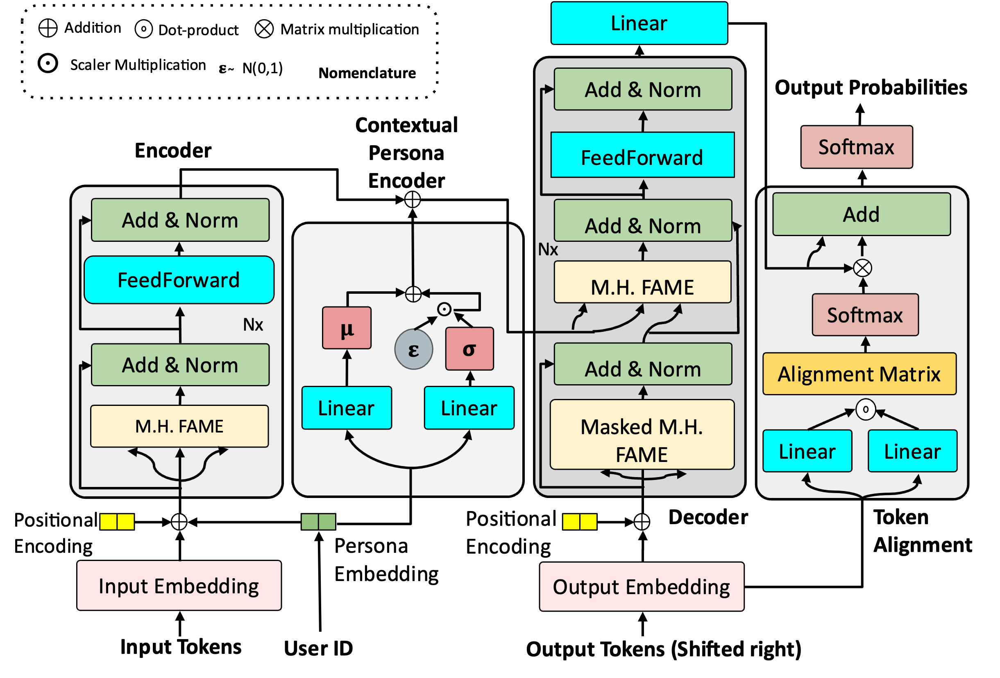

# PARADOX
Code for Persona-Aware Code-Mixed Text Generation.

<h1 align="center"> 
    
</h1>

Code-mixing and script-mixing are prevalent across online social networks and multilingual societies. However, a user's preference toward code-mixing depends on the socioeconomic status, demographics of the user, and the local context, which existing generative models tend to ignore while generating code-mixed texts. In this work, we make a pioneering attempt to develop a persona-aware generative model to generate texts resembling real-life code-mixed texts of individuals. We propose PARADOX, a persona-aware generative model for code-mixed text generation, which is a novel Transformer-based encoder-decoder model that encodes an utterance conditioned on a user's persona and generates code-mixed texts without monolingual reference data. We propose an alignment module that re-calibrates the generated sequence to resemble real-life code-mixed texts. PARADOX generates code-mixed texts that are semantically more meaningful and linguistically more valid. On average, PARADOX achieves 4.2\% better CM BLEU, 11\% better CM Rouge-1, and 9.6\% better CM Rouge-L than the pre-trained Llama 2 and GPT-4 models.

### How to run

	python src/train.py \
    --data_file ./data/twitter_data.csv \
    --model_save_path ./models/ \
    --max_text_len 40 \
    --use_fame \
    --use_persona \
    --use_alignment

### Citation

If you find this code useful, please consider giving a star and citation:
```bibtex
@article{sengupta2024paradox,
  title={Persona-aware Generative Model for Code-mixed Language},
  author={Sengupta, Ayan and Akhtar, Md. Shad and Chakraborty, Tanmoy},
  year={2024}
}
```